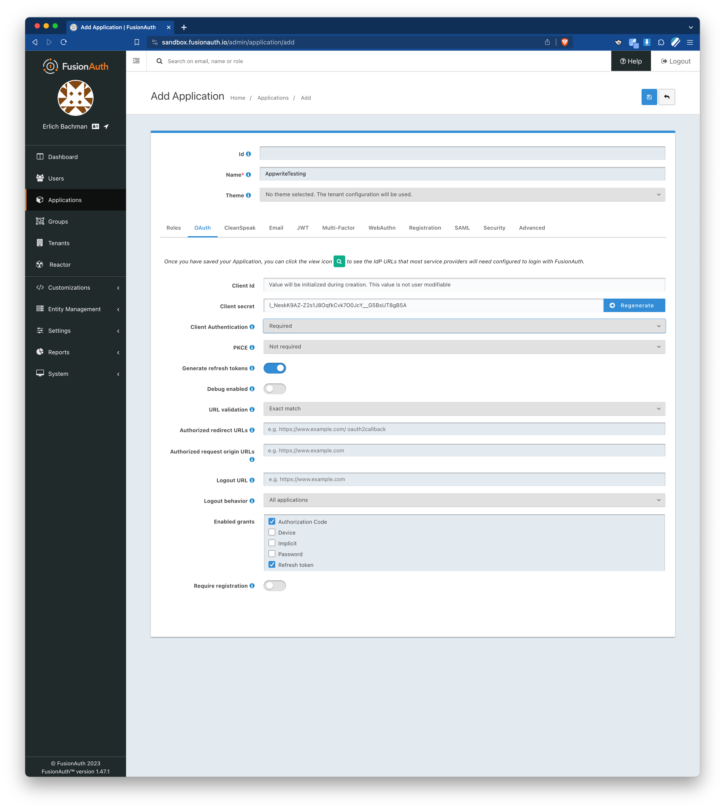

# Test using FusionAuth in Appwrite

This is to use a new Provider in Appwrite

## Setup FusionAuth using Sandbox

While this could easily be setup locally this seems a bit easier.

Login using the Email and Password provided on the initial screen.

Create a new Application Called `AppwriteTesting` make sure that `Authorization Code` and `Refresh Token` are checked.

Save this application

## Setup Appwrite

If testing this before merged make sure to use both the `appwrite` and `console` repos

Pull Requests: 

https://github.com/appwrite/appwrite/pull/6995
https://github.com/appwrite/console/pull/599

Making sure to be on branch (for both): `codercatdev:feat-fusionauth-provider`

Sign Into Appwrite

Create Project named `AppwriteTest`

Add a platform for Web 
Name: `AppwriteTestWeb` 
Hostname `localhost`

Note your the `Initialize SDK` has your projectId.

In Auth -> Settings Find and Enable the Provider `FusionAuth`

In order to find the Client Id and Client Secret you will need to go back into sandbox [applications](https://sandbox.fusionauth.io/admin/application/). Click on the magnifying glass by `AppwriteTesting`. 

Copy these over to the `FusionAuth OAuth2 Settings` form as well as typing in `sandbox.fusionauth.io` into the FusionAuth Domain field.

## Update FusionAuth redirect

In order for a valid redirect to be used you will need to copy the URI provided in the bottom of the `FusionAuth OAuth2 Settings` form.

Example `http://localhost/v1/account/sessions/oauth2/callback/fusionauth/65370bc4301ee8602df9`

This will then need to be added to the FusionAuth Application by clicking the edit pencil next to `AppwriteTesting`.

> Make sure when you paste click the blue box below and make sure it gets set.

Now save the application

## Update .env.local

Rename `.env.local-template` to `.env.local`.

Update `.env.local` with `PUBLIC_APPWRITE_PROJECT` and `PUBLIC_APPWRITE_URL`.

If you don't know where to find your `PUBLIC_APPWRITE_PROJECT` it is by the title. 

The `PUBLIC_APPWRITE_URL` will either be `http://localhost/v1` or your cloud instance `cloud.appwrite.io`.